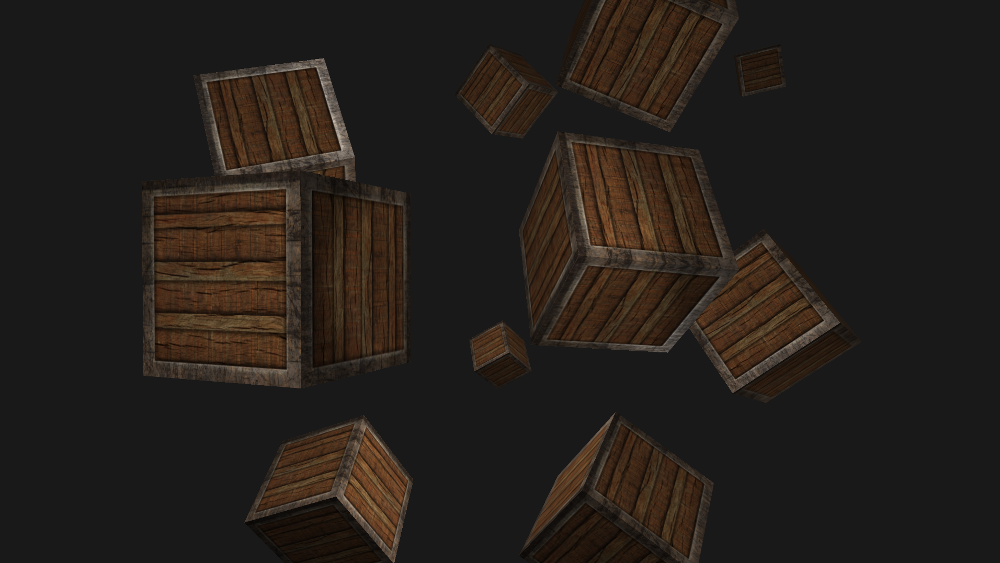

# Zig Learn OpenGL

[Learn OpenGL](learnopengl.com) tutorials ported to the zig programming language. This repo follows
the chronological order of the website, separating out the same functionality into separate files.
The repository is intended to serve as a demonstration of how to use OpenGL with zig, both in user
code, and with the zig build system.

Currently the "Getting Started" and "Lighting" sections have been ported.



## Dependencies

- GLAD (vendored)
- STB (vendored)
- GLFW (byo)

All dependencies except for GLFW are vendored under `deps/`. For GLFW, install using your OS package
manager, or if using windows, install using something like `vcpkg` and edit the paths in `build.zig`.

## Running

Check `build.zig` for the full list of implemented stages, to run the relevant stage, just run its
zig build command, for example:

```bash
zig build hello_triangle    # Renders a colorful triangle
zig build camera            # Renders a scene with many boxes and a camera
zig build multiple_lights   # Renders the same scene but with diffuse/specular maps and multiple lights
```

## Stability

My intention is to keep this repo up to date with the language. This has been tested and works with:

- `0.5.0+d972d1c94`
